# 📊 NarrativeX — AI Pitch Intelligence

> **Your README is technical. Your pitch shouldn't be.**

**NarrativeX** is a full-stack web application that transforms technical README files and project documentation into investor-ready pitch decks. It uses AI to extract structured evidence from your documentation — problem, solution, market, traction — and builds a multi-slide presentation in the language capital understands.

Built with **TanStack Start**, **Google Gemini**, and **Algorand blockchain payments (x402 protocol)**.

🔗 **Live**: [http://localhost:5173](http://localhost:5173)  
📦 **GitHub**: [github.com/vkrr170/NarrativeX](https://github.com/vkrr170/NarrativeX)

---

## 🎯 Problem & Solution

### The Problem
Developers and founders spend weeks translating technical documentation into investor-ready narratives. READMEs describe *what* a product does — but investors need to hear *why it matters*, *who it's for*, and *how it makes money*. This translation gap costs founders time, money, and missed opportunities.

### The Solution
NarrativeX reads your existing README, docs, or technical description and rewrites it as a structured investor pitch — extracting the problem, market, product, competitive advantage, and traction — without inventing a single claim. Every section in the generated deck is backed by evidence found in your documentation or honestly disclosed as missing.

---

## 🏗️ Architecture & Technology Stack

| Layer | Technology |
|---|---|
| **Framework** | TanStack Start (React 19 + Vite 8 SSR) with file-based routing |
| **Language** | TypeScript (end-to-end) |
| **AI Engine** | Vercel AI SDK + Google Gemini 3.7 Flash (`generateObject` with Zod schema validation) |
| **Blockchain Payments** | Algorand x402 protocol — $0.10 USDC per deck via Pera / Defly / Lute Wallet |
| **UI Components** | Radix UI primitives + shadcn/ui + Tailwind CSS v4 |
| **Deck Export** | PptxGenJS (PowerPoint PPTX) + jsPDF (PDF) |
| **Validation** | Zod schemas for pitch data, deck structure, and all API inputs |
| **State Management** | TanStack Query (mutations) + React `useState` |

---

## ⚡ Key Features

- **Evidence-Only AI Analysis**: Gemini extracts structured pitch data from documentation using a strict evidence model — nothing is invented
- **10 Pitch Intelligence Cards**: Problem, Solution, Target Users, Key Features, Market Opportunity, Business Model, Competitive Advantage, Technology, Traction, and Roadmap — only shown when evidence exists
- **6 Professional Deck Styles**: Investor Minimal, Dark Tech, Modern Startup, Data Driven, Bold Founder, Editorial — each with unique palettes, typography, and composition
- **3 Deck Lengths**: Quick Pitch (8–10 slides), Standard (12–15), Deep Dive (16–20)
- **AI-Powered Style Recommendation**: Automatically selects the best style based on your project's evidence signals
- **Web3 Micropayments**: Pay $0.10 USDC per deck on Algorand TestNet via Pera Wallet — no subscriptions, no accounts
- **PPTX & PDF Export**: Download investor-ready presentations in PowerPoint or PDF format
- **Pitch Readiness Dashboard**: Evidence coverage score, confidence notes, and 3 anticipated investor diligence questions
- **Idempotent Payments**: Retry-safe — you're never charged twice for the same deck

---

## 🧠 The Evidence Model

NarrativeX enforces a strict 3-tier evidence classification on every claim:

| Tier | Rule | Example |
|---|---|---|
| **A — Explicitly Supported** | Stated in the documentation | *"Uses Next.js and React"* |
| **B — Reasonable Interpretation** | Inferable from the docs (flagged with confidence note) | *"Market opportunity inferred from problem description"* |
| **C — Missing** | No basis in the documentation — returned as `""` or `[]` | Traction, revenue, user counts left empty |

> **Quantitative claims (market sizes, revenue, user counts, growth rates) are NEVER fabricated.** If a number isn't in your documentation, it doesn't appear in your pitch.

---

## 🚀 Execution Flow

NarrativeX follows a 4-step pipeline from documentation to investor deck:

---

### Step 01 — Landing Page

Users land on a premium, warm-toned interface that introduces NarrativeX's value proposition. The hero section shows a live deck mockup with the core tagline and CTA buttons.

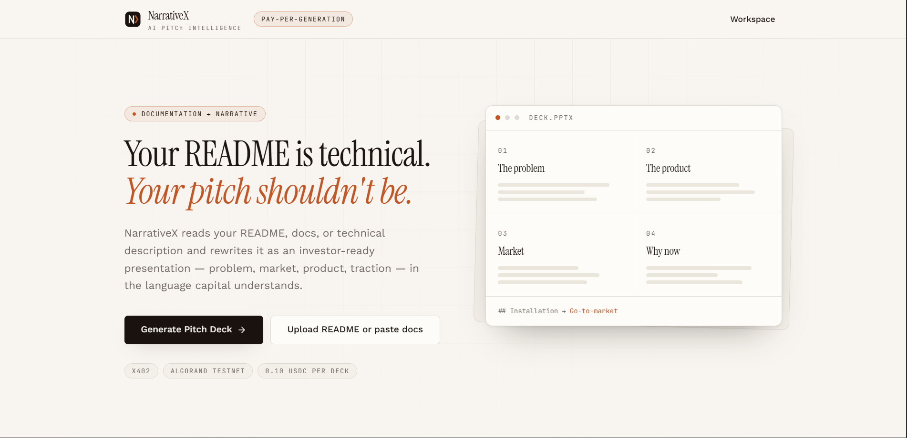

---

### Step 02 — Source Input (Workspace)

Clicking **"Generate Pitch Deck"** or **"Workspace"** opens the workspace. Users can either:
- **Upload a README** file (`.md`, `.markdown`, `.txt`, `.mdx`, `.rst`) via drag-and-drop or file browser
- **Paste documentation** directly into the editor

The system shows word/character count and a real-time "Evidence Detected" indicator.

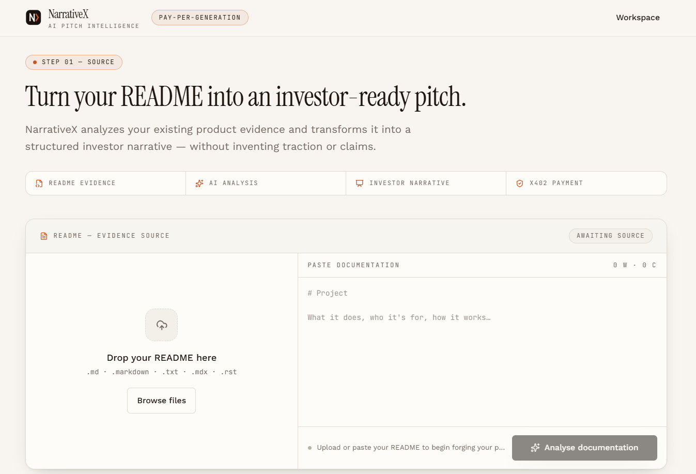

Here, the ContractGuard README has been pasted (708 words, 5,555 characters). The green status badge confirms the source is long enough to analyze.

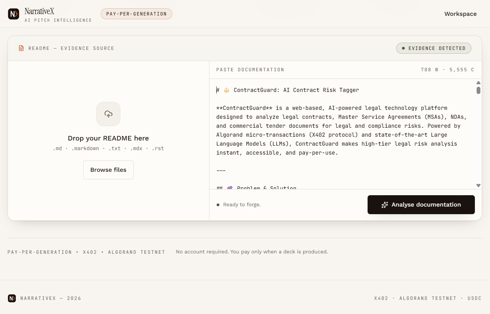

Alternatively, users can upload a file directly. The file chip shows the filename and size with a remove button.

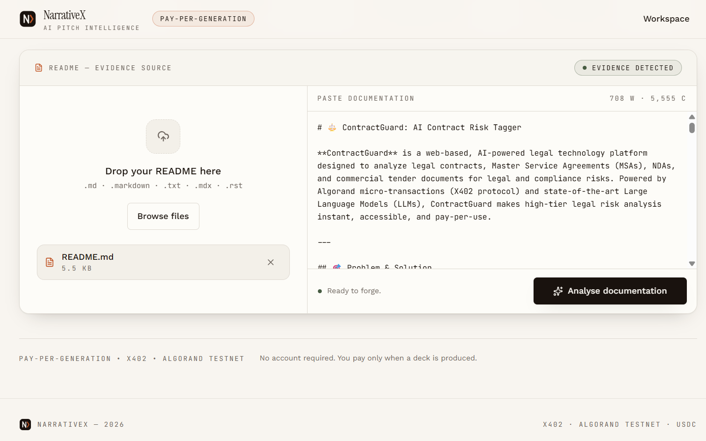

---

### Step 03 — AI Analysis

Clicking **"Analyse documentation"** sends the content to the server, where Google Gemini 3.7 Flash processes it using the evidence model. A 4-stage progress indicator keeps users informed:

1. ✅ Reading your project…
2. ✅ Finding the problem…
3. 🔄 Extracting the evidence…
4. ⏳ Structuring your pitch…

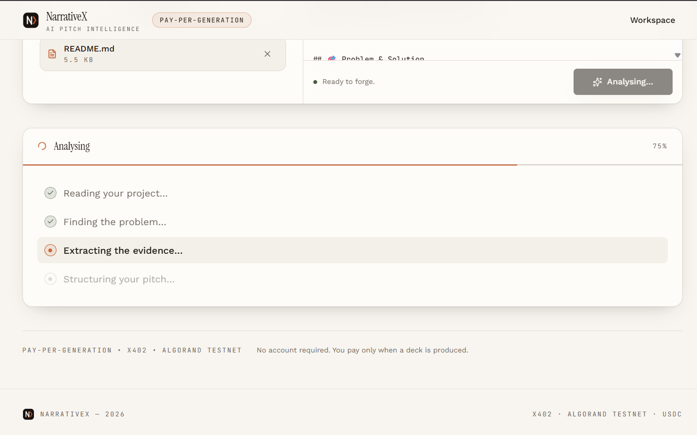

---

### Step 04 — Pitch Intelligence

After analysis, NarrativeX displays the **Pitch Intelligence** panel — a grid of evidence cards extracted from the documentation. Each card shows:
- The **section label** (Problem, Solution, Target Users, etc.)
- An **evidence badge** (`• EVIDENCE`) confirming the section is backed by documentation
- The **extracted content** — bullet points, text, or technology tags

Sections without evidence are **omitted entirely** rather than shown as empty placeholders.

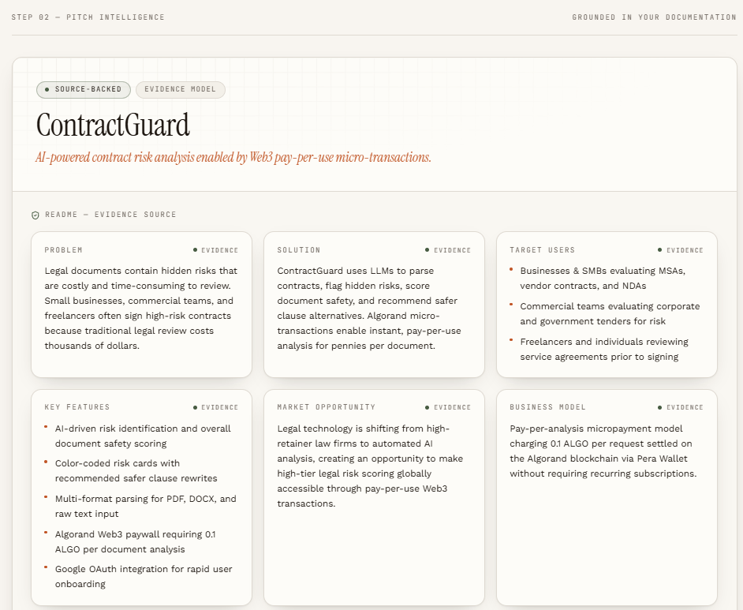

The lower section shows Competitive Advantage, Technology stack (as tag chips), Traction metrics, and Roadmap milestones — all backed by the source README.

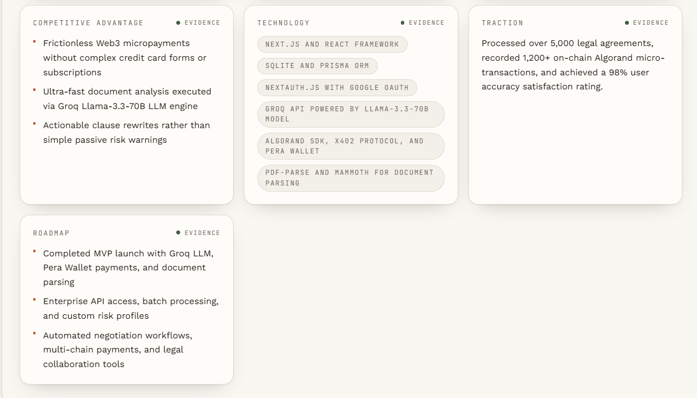

---

### Step 05 — Pitch Readiness & Investor Insights

Below the evidence cards, a **Pitch Readiness** dashboard summarizes the analysis:
- **Evidence Coverage**: 10/10 sections backed (100%)
- **Narrative**: Ready — no scores invented
- **Investor Questions**: 3 anticipated diligence prompts targeting the weakest parts of the pitch
- **Market Data**: Presence/absence of quantitative figures
- **Confidence Notes**: Honest disclosures about inferred sections

The **Investor Insights** panel shows 3 questions an investor would most likely ask about *this specific project*.

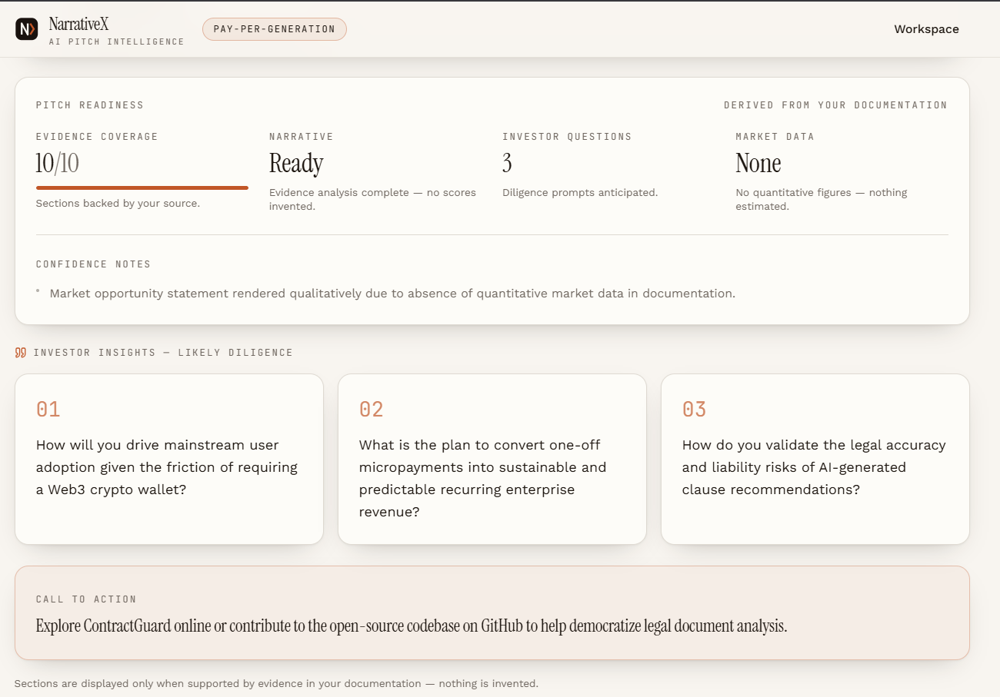

---

### Step 06 — Deck Format Selection

Users choose from **6 professional styles** and **3 deck lengths**:

**Styles:**
| Style | Best For |
|---|---|
| Investor Minimal | Classic YC / seed-round reading decks |
| Dark Tech | AI, SaaS, and developer infrastructure |
| Modern Startup | Product-led consumer and B2B startups |
| Data Driven | Evidence-heavy, analytical audiences |
| Bold Founder | Live pitching and demo-day storytelling |
| Editorial | Narrative-first, story-led pitches |

NarrativeX auto-recommends a style based on evidence signals (e.g., technical stack detected → Dark Tech).

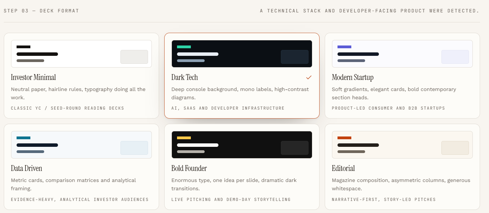

**Lengths:**
- **Quick Pitch**: 8–10 slides (core narrative only)
- **Standard Pitch**: 12–15 slides (full investor arc)
- **Deep Dive**: 16–20 slides (landscape, GTM, investor lens)

The "Ready to forge" panel confirms the configuration before triggering payment.

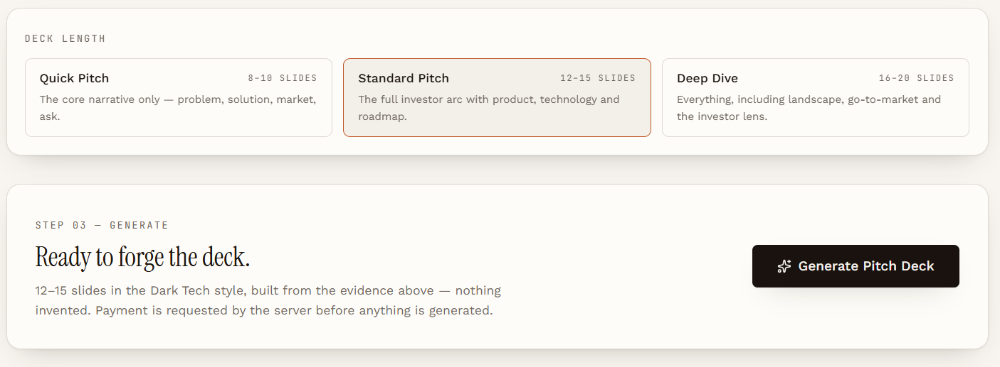

---

### Step 07 — x402 Payment (Algorand)

Clicking **"Generate Pitch Deck"** triggers the **x402 payment protocol**:

1. The server returns **HTTP 402** with payment requirements
2. The payment panel displays: **0.10 USDC**, receiver address, scheme (exact), and network (Algorand TestNet)
3. Users connect a wallet (Pera, Defly, or Lute)

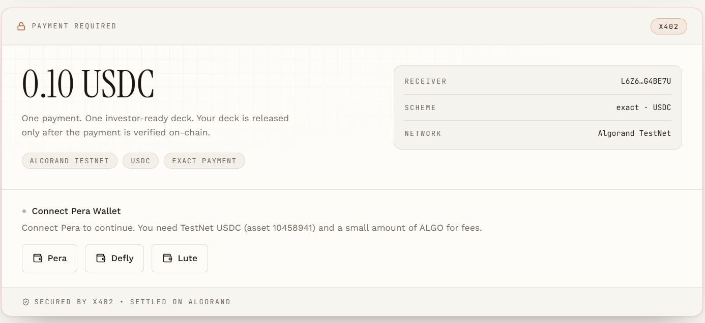

Clicking **Pera** opens the Pera Connect modal with a QR code for mobile scanning or web connection.

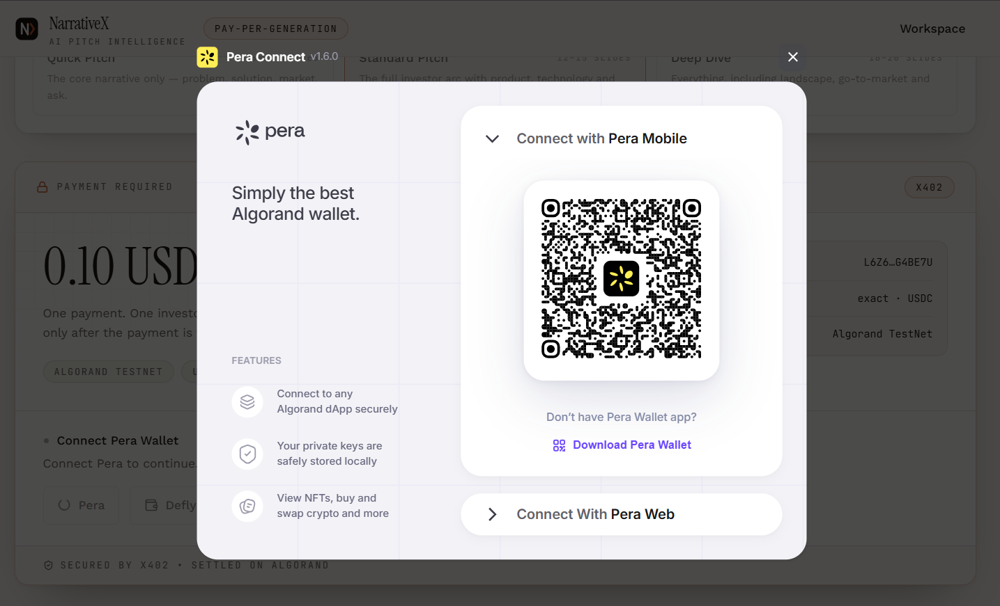

Once connected, the wallet address is displayed and the **"Pay 0.10 USDC & Generate Deck"** button becomes active.

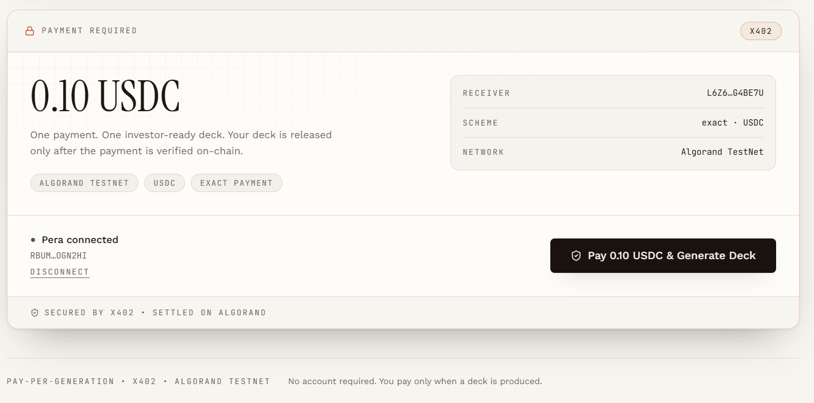

---

### Step 08 — Deck Generated

After successful payment verification on the Algorand blockchain:
- The **"Deck Ready"** panel confirms generation
- The **on-chain transaction ID** is displayed with a link to the **Algorand Explorer**
- Users can generate another deck from the same documentation

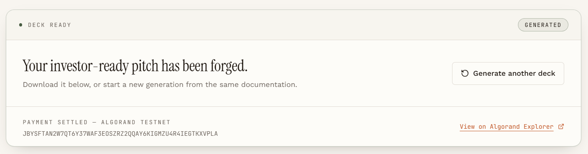

---

### Step 09 — Deck Preview & Export

The final **Deck Preview** shows:
- **Slide thumbnails** (scrollable sidebar) with navigation
- **Full-size slide preview** with keyboard arrow navigation
- **Style and quality badges**: Dark Tech, Standard Pitch, 13 slides, 100% evidence-backed
- **Download buttons**: PPTX (PowerPoint) and PDF

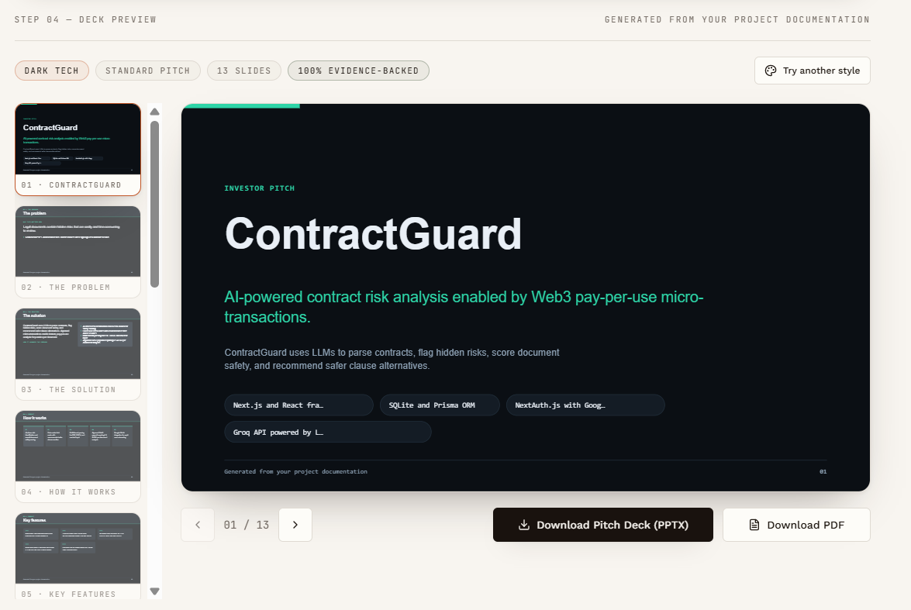

---

## 💼 Business Model

NarrativeX operates on a **pay-per-generation micropayment model**:
- **No subscriptions** — users pay only when a deck is produced
- **No accounts required** — wallet-based authentication
- **$0.10 USDC per deck** — settled on-chain via Algorand
- **Idempotent retries** — a failed retry is never charged twice
- **x402 protocol** — the HTTP-native payment standard for machine-to-machine commerce

---

## 🛡️ How x402 Payment Works (Technical)

```
Client                          Server                     Facilitator (GoPlausible)
  │                                │                              │
  ├─── POST /generate-deck ──────►│                              │
  │                                ├─── HTTP 402 ────────────────►│
  │◄── Payment Requirements ──────┤    (payment terms)           │
  │                                │                              │
  ├─── Sign tx in Pera Wallet ───►│                              │
  │                                │                              │
  ├─── POST + PAYMENT-SIGNATURE ─►│                              │
  │                                ├─── Verify payment ──────────►│
  │                                │◄── Payment confirmed ────────┤
  │                                │                              │
  │                                ├─── Build deck ──────────────►│
  │                                │                              │
  │◄── Deck JSON + Settlement ────┤                              │
  │    (PAYMENT-RESPONSE header)   │                              │
```

---

## 💻 Getting Started (Local Development)

### Prerequisites
- **Node.js** v18+
- **Algorand TestNet Wallet** (Pera Wallet recommended)
- **Google AI API Key** (Gemini access)
- TestNet USDC + ALGO for payment testing

### Installation

1. **Clone the repository:**
   ```bash
   git clone https://github.com/vkrr170/NarrativeX.git
   cd NarrativeX
   ```

2. **Install dependencies:**
   ```bash
   npm install
   ```

3. **Set up Environment Variables:**
   Create a `.env` file (see `.env.example`):
   ```env
   GOOGLE_GENERATIVE_AI_API_KEY=your-gemini-api-key
   AVM_ADDRESS=your-algorand-receiver-address
   ```

4. **Start the Development Server:**
   ```bash
   npm run dev
   ```
   The app will be running at `http://localhost:5173`.

### Optional Environment Variables

| Variable | Default | Purpose |
|---|---|---|
| `GOOGLE_GENERATIVE_AI_API_KEY` | — | Gemini API key for README analysis |
| `AVM_ADDRESS` | — | Algorand address receiving USDC payments |
| `X402_NETWORK` | `testnet` | `testnet` or `mainnet` |
| `FACILITATOR_URL` | GoPlausible | x402 payment facilitator |
| `PITCH_DECK_PRICE` | `0.10` | USD price per deck generation |

---

## 📁 Project Structure

```
NarrativeX/
├── src/
│   ├── components/           # React UI components
│   │   ├── source-composer   # README upload & paste interface
│   │   ├── pitch-intelligence # Evidence cards grid
│   │   ├── deck-config       # Style & length selector
│   │   ├── deck-preview      # Slide preview & export
│   │   ├── payment-panel     # x402 payment flow
│   │   ├── wallet-provider   # Algorand wallet (Pera/Defly/Lute)
│   │   └── ui/               # shadcn/ui primitives
│   ├── lib/
│   │   ├── pitch/            # AI analysis pipeline
│   │   │   ├── schema.ts     # Zod pitch schema (16 fields)
│   │   │   ├── analyze.server.ts  # Gemini structured extraction
│   │   │   └── types.ts      # Source input types
│   │   ├── deck/             # Deck generation engine
│   │   │   ├── build.ts      # Pitch → slides (deterministic)
│   │   │   ├── schema.ts     # Slide/deck Zod schemas
│   │   │   ├── styles.ts     # 6 style definitions + auto-recommend
│   │   │   ├── layout.ts     # Slide → draw operations
│   │   │   └── export.ts     # PPTX + PDF export
│   │   └── x402/             # Payment infrastructure
│   │       ├── client.ts     # Browser-side payment flow
│   │       ├── config.server.ts   # Server-side x402 config
│   │       ├── resource-server.server.ts  # HTTP 402 middleware
│   │       ├── idempotency.server.ts  # Replay protection
│   │       └── shared.ts     # Payment types & helpers
│   ├── routes/
│   │   ├── index.tsx          # Landing page
│   │   ├── workspace.tsx      # Main workspace
│   │   └── api/public/        # Server API routes
│   │       ├── generate-deck.ts   # x402-protected deck API
│   │       ├── x402-status.ts     # Payment config diagnostic
│   │       └── health.ts         # Health check
│   └── styles.css             # Global styles + design tokens
├── public/
│   └── docs/                  # Execution flow screenshots
├── .env.example               # Environment variable template
├── package.json
├── vite.config.ts
└── tsconfig.json
```

---

## 🔑 Core Design Decisions

1. **AI extracts data, not layout** — Gemini produces structured pitch fields; the layout engine is deterministic and pure
2. **Evidence-first, not invention-first** — Empty sections are disclosed, never fabricated
3. **Payment before generation** — The server never builds a deck until payment is verified on-chain
4. **Idempotency built-in** — Retries return the same deck without re-charging
5. **Style is structural, not cosmetic** — Each style carries its own palette, density, type scale, and composition rules

---

## 👥 Target Users

- **Startup Founders** — Transform technical docs into investor-ready decks before fundraising
- **Hackathon Teams** — Generate polished pitch decks from project READMEs in minutes
- **Developer Advocates** — Convert open-source documentation into stakeholder presentations
- **Technical Co-founders** — Bridge the gap between engineering documentation and business narrative
